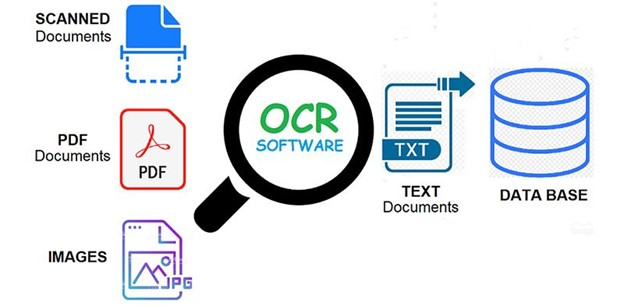
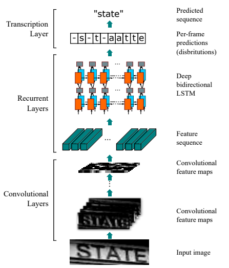
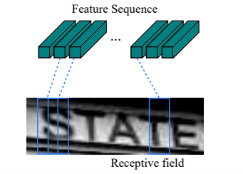

# Custorm CRNN OCR

## OCR

OCR, or Optical Character Recognition, is a process of recognizing text inside images and converting it into an electronic form. These images could be of handwritten text, printed text like documents, receipts, name cards, etc., or even a natural scene photograph.

## CRNN Custom OCR Model

Custom Convolutional Recurrent Neural Network OCR 

Convolutional-recurrent neural network suggests a hybrid end to end architecture, that is intended to capture words, in a three step approach.

The idea goes as follows: the first level is a standard fully convolutional network. The last layer of the net is defined as feature layer and divided into “feature columns"
See image:

Afterwards, the feature columns are fed into a deep-bidirectional LSTM which outputs a sequence and is intended for finding relations between the characters.

Finally, the third part is a transcription layer. Its goal is to take the messy character sequence, in which some characters are redundant, and others are blank, and use probabilistic method to unify and make sense out of it.

This method is called CTC loss, and can be read about here. This layer can be used with/without predefined lexicon, which may facilitate predictions of words.

This paper reaches high (>95%) rates of accuracy with fixed text lexicon, and varying rates of success without it.

## Dataset

The data set used in the training is Captcha dataset

#### The sole purpose of this repository is to teach people how to make custom OCR models using Deep Learning.
